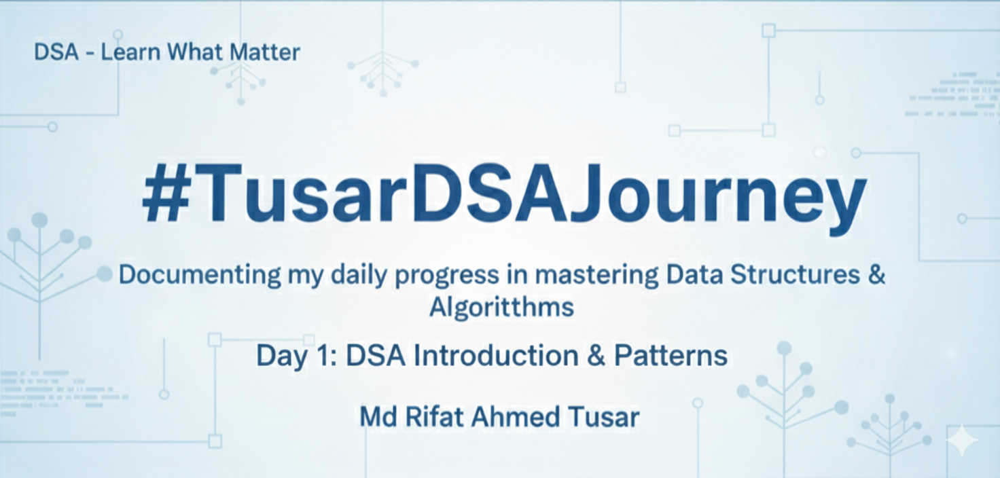

  

🚀 #TusarDSAJourney is my personal documentation of learning Data Structures & Algorithms (DSA) — one day at a time.

I’m sharing my daily progress, insights, and problem-solving experiences as I strengthen my foundations in algorithms, data organization, and efficient coding. My daily progress can be found in this repository, or on my [LinkedIn](https://www.linkedin.com/in/rifat-ahmed-tusar/) profile and [Facebook](https://www.facebook.com/share/p/1BS6QfvbuG/).

Through this series, I aim to:

-   Build a strong problem-solving mindset
-   Improve my coding speed and logic
-   Inspire others who are also learning DSA
-   Track my growth publicly and stay accountable

Each post in this series will cover a small step, from arrays and recursion to dynamic programming and graphs — along with key takeaways and reflections.

Whether you’re a beginner or already deep into DSA, I hope these posts motivate you to keep learning and improving every day.

🧠 Follow along the hashtag #TusarDSAJourney to see all my posts in one place!

Let’s grow together 💪
